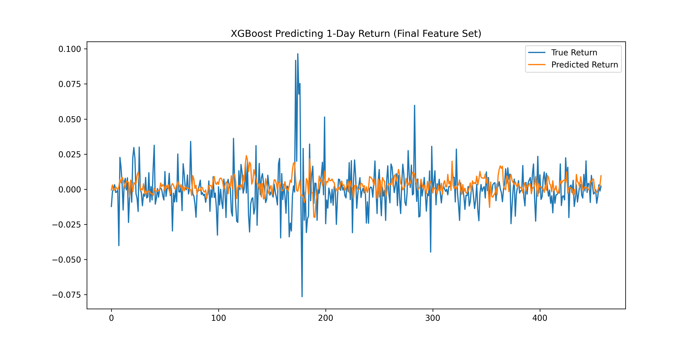

# 基于XGBoost的股票次日收益预测
使用多种技术指标构建特征，通过 XGBoost 回归模型预测下一日收益率。
## 环境说明

pip install akshare pandas numpy scikit-learn xgboost matplotlib

## 项目简介
本项目通过AkShare获取日频股票数据，构造19个常见技术指标（MA、EMA、RSI、MACD、BOLL、动量、波动率等），并使用XGBoost回归模型预测股票的次日收益率。
项目完整展示量化研究中：数据 → 特征工程 → 模型 → 可视化 → 结果分析的完整流程。
适合作为量化因子、机器学习策略的基础模板。
## 项目结构

    ├── data/                         # 原始数据 / 清洗后数据
    ├── stock_return_xgb.ipynb        # 主 Notebook（特征工程 + 模型训练）
    └── README.md                     # 项目说明

## 数据来源与说明
通过akshare获取股票每日行情，包括：
开盘价（open）

最高价（high）

最低价（low）

收盘价（close）

成交量（volume）

目标变量（y）：次日收益率
$$ret_1d = (close_{t+1} - close_t) / close_t$$
## 数据清洗包括：
删除 inf / -inf

删除 NaN

重置索引

## 特征工程（共 19 个技术指标）
以下为构造的全部特征：

1. 移动平均指标（MA / EMA）

| 特征    | 含义       |
| ----- | -------- |
| MA5   | 5 日移动平均  |
| MA10  | 10 日移动平均 |
| MA20  | 20 日移动平均 |
| EMA5  | 5 日指数平均  |
| EMA10 | 10 日指数平均 |
| EMA20 | 20 日指数平均 |

2️. 动量指标（Momentum）
| 特征    | 含义     |
| ----- | ------ |
| MOM5  | 5 日动量  |
| MOM10 | 10 日动量 |
| MOM20 | 20 日动量 |

动量公式：

$MOM_n = (P_t / P_{t-n}) - 1$

3. 波动率指标

| 特征    | 含义         |
| ----- | ---------- |
| RSI14 | 14 日相对强弱指数 |

4. RSI指标

| 特征    | 含义         |
| ----- | ---------- |
| RSI14 | 14 日相对强弱指数 |

5. MACD系列指标

| 特征   | 含义  |
| ---- | --- |
| MACD | 柱状线 |
| DEA  | 信号线 |
| DIFF | 快线  |

MACD公式：

DIF = EMA(12) - EMA(26)

DEA = EMA(DIF, 9)

MACD = 2 * (DIF - DEA)

6. 布林带

| 特征          | 含义 |
| ----------- | -- |
| BOLL_UPPER  | 上轨 |
| BOLL_MIDDLE | 中轨 |
| BOLL_LOWER  | 下轨 |
| BOLL_WIDTH  | 带宽 |

## 目标变量

$ret_1d = (close_{t+1} - close_t) / close_t$

## 模型:XGBoost Regressor

model = XGBRegressor(
    n_estimators=300,
    max_depth=5,
    learning_rate=0.05,
    subsample=0.8,
    colsample_bytree=0.8
    )

选择 XGBoost 的原因：

- 能拟合非线性关系

- 对噪声与异常值鲁棒

- 内置特征重要性评估

- 在表格数据上表现优秀

## 结果：MSE指标

MSE=0.000257

预测和实际收益：

## 特征重要性

| 排名 | 特征         | 重要性    |
| -- | ---------- | ------ |
| 1  | EMA20      | 0.1130 |
| 2  | EMA10      | 0.1083 |
| 3  | MA20       | 0.1042 |
| 4  | MOM10      | 0.0891 |
| 5  | BOLL_WIDTH | 0.0822 |

趋势类指标贡献最大（MA/EMA/动量）说明短期收益主要受趋势影响而非震荡型指标。

## 总结
技术指标对短期收益具有弱但存在的预测能力

趋势类指标最具信息量

市场噪声大，不可能“预测很准”

XGBoost 是金融因子的优秀 baseline
